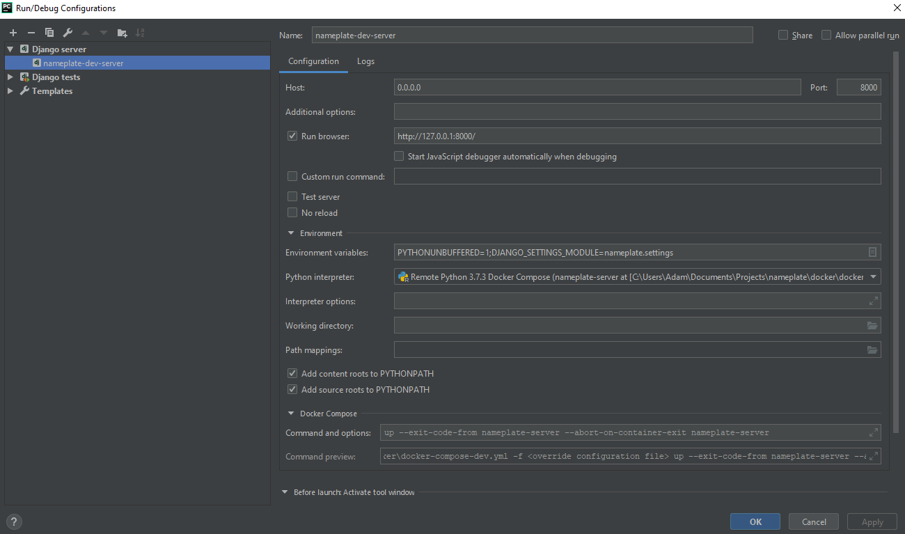

# nameplate

A kiosk API for displaying conference room information

## Development Environment Setup

### Required Software

* Pycharm Professional
* Docker
* A unix-like shell.  If you're using Windows, try [Cmder](https://cmder.net/).

### Outlook API keys

Generate API keys per the instructions [here](https://docs.microsoft.com/en-us/outlook/rest/python-tutorial)

Use the endpoint http://127.0.0.1:8000/get_token

### Docker Secrets

```bash
# Start or join a swarm
mkdir .keys
echo "APP ID" > .keys/nameplate_api_id
echo "APP PASSKEY" > .keys/nameplate_api_passkey
```

### Pycharm

Opening the repository in Pycharm should load the project settings correctly.

The project interpreter is a Docker Compose interpreter, running `.../docker/docker-compose-dev.yml`

Create a Run/Debug configuration with the settings shown below:


